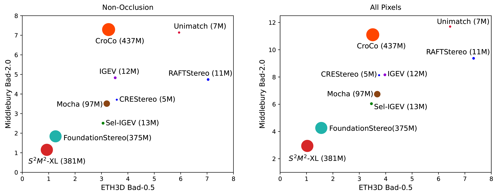

<div align="center">

# **[S<sup>2</sup>M<sup>2</sup>: Scalable Stereo Matching Model for Reliable Depth Estimation]**
<p align="center">
  
</p>

<!-- **[Author Name 1]<sup>1</sup>, [Author Name 2]<sup>2</sup>, [Author Name 3]<sup>1,2</sup>** -->

<!-- <sup>1</sup>[Affiliation 1, e.g., Awesome University], <sup>2</sup>[Affiliation 2, e.g., Awesome AI Lab]

**Computer Vision and Pattern Recognition (CVPR), 2025**

<p align="center">
  <a href="[링크-투-논문-PDF]"><strong>📖 Paper</strong></a> |
  <a href="[링크-투-프로젝트-웹사이트]"><strong>🌐 Project Page</strong></a> |
  <a href="[링크-투-데모-비디오]"><strong>🎥 Video</strong></a> |
  <a href="[링크-투-HuggingFace-Spaces-데모]"><strong>🤗 Online Demo</strong></a>
</p>
-->
</div>

---
## 🤗 Notice
* The demo code and the pre-trained models for this paper are scheduled to be released at the end of October, 2025. Stay tuned.

## 📖 Abstract
The pursuit of a generalizable stereo matching model, capable of performing well across varying resolutions and disparity ranges without dataset-specific fine-tuning, has revealed a fundamental trade-off. Iterative local search methods achieve high scores on constrained benchmarks, but their core mechanism inherently limits the global consistency required for true generalization. However, global matching architectures, while theoretically more robust, have historically been rendered infeasible by prohibitive computational and memory costs. We resolve this dilemma with S²M²: a global matching architecture that achieves state-of-the-art accuracy and high efficiency without relying on cost volume filtering or deep refinement stacks. Our design integrates a multi-resolution transformer for robust long-range correspondence, trained with a novel loss function that concentrates probability on feasible matches. This approach enables a more robust joint estimation of disparity, occlusion, and confidence. S²M² establishes a new state of the art on Middlebury v3 and ETH3D benchmarks, significantly outperforming prior methods in most metrics while reconstructing high-quality details with competitive efficiency.

## ✨ Key Features

### Model
- **Scalable Stereo Matching Architecture**
- **State-of-the-Art Performance in ETH3D (1st) and Middlebury V3 (1st)**
- **Occlusion and Confidence Estimation**
- **Allow Negative Disparity Estimation**

### Code
- ✅ FP16/FP32 Inference
- ✅ ONNX export 
- ✅ Torchscript export
- ❌ Training Pipeline

## 📌 Implementation Note
The implementation in this repository is slightly different from the model described in the original paper. 
- The attention based global refinement module which contains dynamic operations was replaced by a simple unet for stable onnx export. 
- The training dataset was slightly extended to include additional samples containing transparent objects. 
- The original paper provides **S, L, XL** models. This repository also includes additional variant **M**
---

## 🏛️ Model Architecture
<p align="center">
  
</p>


## 📊 Results
### Real-dataset Benchmarks 
<p align="center">
  
</p>


<p align="center">
  
</p>


<p align="center">
  
</p>


<!--
### Qualitative Comparison

[모델의 질적 성능을 다른 모델과 시각적으로 비교하는 이미지 테이블입니다.]

| Input | [Baseline Method] | **Ours (Model-L)** |
| :---: | :---: | :---: |
|  |  |  |
| *[Caption for row 1]* |
|  |  |  |
| *[Caption for row 2]* |
-->

### Inference Speed (fps) Comparison

Nvidia 4090 + float16 + torch.compile + refine_iter=3 

| Model | CH | NTR | 640x480px | 1216x1024px | 2432x2048px |
| :--- | :---: | :---: | :---: | :---: | :---: |
| **S** | 128 | 1 | 68.7 | 18.8 | 3.9 |
| **M** | 192| 2 | 34.8 | 8.9 | 1.9 |
| **L** | 256 | 3 | 20.5 | 5.3 | 1.2 |
| **XL** | 384 | 3 | 11.2 | 2.7 | 0.64 |

---

## 🔧 Installation

The codebase is developed and tested with Python 3.10 and PyTorch 2.4+. We recommend setting up the environment using Anaconda.

1.  **Clone the repository:**
    ```bash
    git clone https://github.sec.samsung.net/junhong1-min/s2m2.git
    cd s2m2
    ```

2.  **Create and activate the conda environment:**
    The `environment.yml` file contains all necessary packages.
    ```bash
    conda env create -f environment.yml
    conda activate s2m2
    ```

---

## 🚀 Pre-trained Models and Inference

### 1. Download Pre-trained Models

Create a directory for weights and download the desired models from the links below.

```bash
mkdir pretrain_weights
```

| Model | Download | Model Size |
| :---: | :---: | :--: |
| **S** | [download] | 26.5M | 
| **M** | [download] | 80.4M | 
| **L** | [download] | 181M | 
| **XL**| [download] | 406M | 

### 2. Run Basic Demo
To generate a result for a single input, run `visualize_2d_simple.py`.

```bash
python visualize_2d_simple.py --model_type XL \
               --num_refine 3 
```
| Arg | default | type | help |
| :---: | :---: | :--: | :--: |
| --model_type | 'XL' | str | select model type: [S,M,L,XL] |
| --num_refine | 3 | int | number of local iterative refinement |
| --torch_compile | False | set_true | apply torch_compile  | 
| --allow_negative | False | set_true | allow negative disparity  | 


### 3. Run 3D Visualization Demo

To visualize the 3D output interactively, run `visualize_3d_booster.py` or `visualize_3d_middlebury.py`

```bash
python visualize_3d_booster.py --model_type L 
```

---

## 📜 Citation

If you find our work useful for your research, please consider citing our paper:
```bibtex
@misc{min2025stextsuperscript2mtextsuperscript2,
    title={{S\textsuperscript{2}M\textsuperscript{2}}: Scalable Stereo Matching Model for Reliable Depth Estimation},
    author={Junhong Min and Youngpil Jeon and Jimin Kim and Minyong Choi},
    year={2025},
    eprint={2507.13229},
    archivePrefix={arXiv},
    primaryClass={cs.CV}
}
```

[comment]: <> (## 🙏 Acknowledgments)

[comment]: <> ([This research was supported by ... . We would like to thank ... for their valuable feedback and ... for providing computational resources.])

[comment]: <> (## ⚖️ License)

[comment]: <> (This project is licensed under the **[MIT License]**. See the `LICENSE` file for details.)
