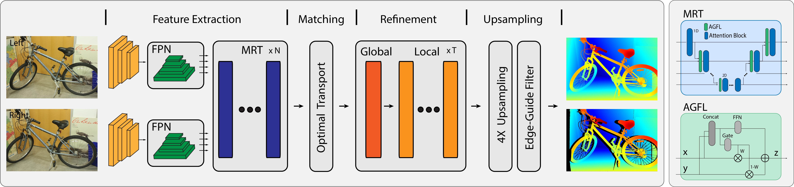

[S2M2: Scalable Stereo Matching Model for Reliable Depth Estimation]

Junhong Min¹,*, Youngpil Jeon¹, Jimin Kim¹, Minyong Choi¹

¹Samsung Electronics

*Corresponding Author

International Conference on Computer Vision (ICCV) 2025

<!--
"style=for-the-badge"는 크고 모던한 스타일의 배지를 만듭니다.
"logo=" 부분에 원하는 아이콘 이름을 넣을 수 있습니다.
-->

🤗 Notice

The demo code and the pre-trained models for this paper are scheduled to be released at the end of October, 2025. Stay tuned.

📖 Abstract

The pursuit of a generalizable stereo matching model, capable of performing well across varying resolutions and disparity ranges without dataset-specific fine-tuning, has revealed a fundamental trade-off. Iterative local search methods achieve high scores on constrained benchmarks, but their core mechanism inherently limits the global consistency required for true generalization. However, global matching architectures, while theoretically more robust, have historically been rendered infeasible by prohibitive computational and memory costs. We resolve this dilemma with S²M²: a global matching architecture that achieves state-of-the-art accuracy and high efficiency without relying on cost volume filtering or deep refinement stacks. Our design integrates a multi-resolution transformer for robust long-range correspondence, trained with a novel loss function that concentrates probability on feasible matches. This approach enables a more robust joint estimation of disparity, occlusion, and confidence. S²M² establishes a new state of the art on Middlebury v3 and ETH3D benchmarks, significantly outperforming prior methods in most metrics while reconstructing high-quality details with competitive efficiency.

✨ Key Features

Model

Scalable Stereo Matching Architecture

State-of-the-Art Performance in ETH3D (1st) and Middlebury V3 (1st)

Occlusion and Confidence Estimation

Allow Negative Disparity Estimation

Code

✅ FP16/FP32 Inference

✅ ONNX export

✅ Torchscript export

❌ Training Pipeline

📌 Implementation Note

The implementation in this repository is slightly different from the model described in the original paper.

The attention based global refinement module which contains dynamic operations was replaced by a simple unet for stable onnx export.

The training dataset was slightly extended to include additional samples containing transparent objects.

The original paper provides S, L, XL models. This repository also includes additional variant M

🏛️ Model Architecture

🚀 Performance

(Detailed benchmark results and visualizations are available on our Project Page.)

Inference Speed (fps) Comparison

Nvidia 4090 + float16 + torch.compile + refine_iter=3

Model

CH

NTR

640x480px

1216x1024px

2432x2048px

S

128

1

68.7

18.8

3.9

M

192

2

34.8

8.9

1.9

L

256

3

20.5

5.3

1.2

XL

384

3

11.2

2.7

0.64

🔧 Installation

The codebase is developed and tested with Python 3.10 and PyTorch 2.4+. We recommend setting up the environment using Anaconda.

Clone the repository:

git clone [https://github.com/junhong-3dv/s2m2.git](https://github.com/junhong-3dv/s2m2.git)
cd s2m2

Create and activate the conda environment:
The environment.yml file contains all necessary packages.

conda env create -f environment.yml
conda activate s2m2

🚀 Pre-trained Models and Inference

1. Download Pre-trained Models

Create a directory for weights and download the desired models from the links below.

mkdir pretrain_weights

Model

Download

Model Size

S

[download]

26.5M

M

[download]

80.4M

L

[download]

181M

XL

[download]

406M

2. Run Basic Demo

To generate a result for a single input, run visualize_2d_simple.py.

python visualize_2d_simple.py --model_type XL \
               --num_refine 3 

Arg

default

type

help

--model_type

'XL'

str

select model type: [S,M,L,XL]

--num_refine

3

int

number of local iterative refinement

--torch_compile

False

set_true

apply torch_compile

--allow_negative

False

set_true

allow negative disparity

3. Run 3D Visualization Demo

To visualize the 3D output interactively, run visualize_3d_booster.py or visualize_3d_middlebury.py

python visualize_3d_booster.py --model_type L 

📜 Citation

If you find our work useful for your research, please consider citing our paper:

@inproceedings{min2025s2m2,
  title={{S\textsuperscript{2}M\textsuperscript{2}}: Scalable Stereo Matching Model for Reliable Depth Estimation},
  author={Junhong Min and Youngpil Jeon and Jimin Kim and Minyong Choi},
  booktitle={Proceedings of the IEEE/CVF International Conference on Computer Vision (ICCV)},
  year={2025}
}
